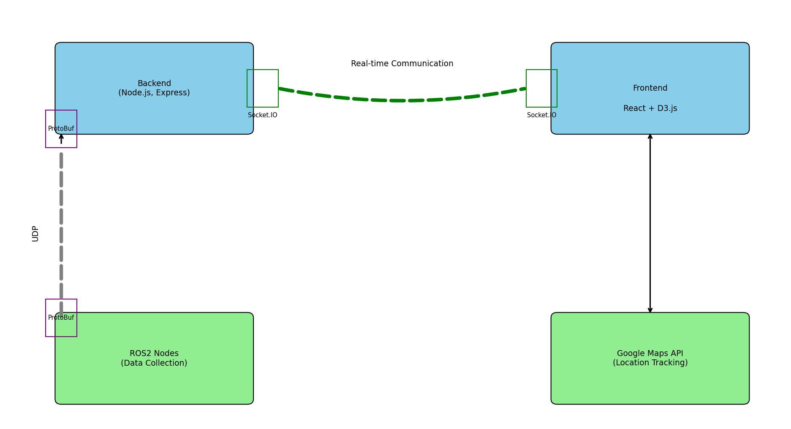

# Getting Started with IU Racing Dashboard

# Overview
 Racing dashboard for an autonomous racing car involves integrating various technologies to track and display real-time data such as speed, location, throttle, brake, steering angle, and tire temperature. Here's an overview of the components and their interactions:

## Available Scripts

Go to the project directory, you can run:

## `npm install` or `npm install ModuleName`

Installing all the dependencies at once or installing by module.
can be viewed in Package.json

## `npm start`

Runs the app in the development mode.\
Open [http://localhost:3000](http://localhost:3000) to view it in your browser.

The page will reload when you make changes.\
You may also see any lint errors in the console.

You can learn more in the [Create React App documentation](https://facebook.github.io/create-react-app/docs/getting-started).

To learn React, check out the [React documentation](https://reactjs.org/).

## Components and Technologies Used
### Frontend (React):

*React:* For building a dynamic and responsive user interface.

*Google Maps API:* To display the car's location on a map in real-time.

*Socket.IO:* For real-time communication between the client and the server.

*D3.js:* For creating interactive data visualizations (e.g., Zooming Animation).
### Backend (Node.js, Express):

*Node.js and Express:* To create a server that handles incoming data from the car and serves it to the client.

*Socket.IO:* To facilitate real-time bidirectional communication between the server and the client.

*Protocol Buffers (ProtoBuf):* To serialize and deserialize structured data efficiently for communication between systems.

*ROS2 (Robot Operating System 2):* For handling the car's sensors and control data, providing a flexible framework for autonomous vehicle communication.

## Data Flow and Integration

### Data Collection:

The autonomous racing car is equipped with various sensors to measure speed, location, throttle position, brake pressure, steering angle, and tire temperature.
ROS2 nodes are responsible for collecting data from these sensors and publishing it to relevant topics.

### Data Serialization:

Sensor data is serialized using Protocol Buffers (ProtoBuf) for efficient and compact transmission.
This serialized data is sent to the backend server via ROS2.

### Backend Server:

The Node.js server, built with Express, receives serialized data from the car.
The server deserializes the data using ProtoBuf and processes it as needed.
Real-time data is then sent to the frontend using Socket.IO.

### Frontend Display:

* The React frontend establishes a Socket.IO connection to receive real-time updates from the server.
Data visualizations are created using react.js and D3.js to provide interactive and informative displays for speed, throttle, brake, steering angle, and tire temperature.
* Google Maps API is used to display the car's current location on a map, with real-time updates based on incoming data.
Key Features
* *Real-Time Tracking:* The dashboard updates in real-time, reflecting the car's current status and performance metrics.

* *Interactive Visualizations:* Speedometer, throttle and brake meters, and tire temperature gauges provide clear and interactive representations of the car's status.

* *Location Tracking:* Google Maps API integration allows for real-time location tracking, displaying the car's movement on a map.
Efficient Data Handling: Use of ProtoBuf ensures efficient serialization and deserialization of data, reducing latency and improving performance.

* *Scalability and Flexibility:* The use of ROS2 allows for easy integration of additional sensors and data points as needed, making the system scalable and adaptable to future requirements.

## Example Workflow
- *Car Sensor Data:* Sensors on the car collect data on speed, location, throttle, brake, steering angle, and tire temperature.
- *ROS2 Publication:* Data is published to ROS2 topics, serialized using ProtoBuf.
- *Backend Server:* Node.js server receives serialized data, deserializes it, and processes it.
- *Socket.IO* Communication: Processed data is sent to the frontend via Socket.IO.
- *Frontend Visualization:* React frontend receives data, updates visualizations (D3.js), and displays the car's location on a Google Map.

## Workflow Diagram

# Index
1) [Go to Styling](#Styling)
2) [Go to Starting Point of User Interface](#Starting_Point)
3) [Go to Source Files](#source_files)
4) [Go to Component_Stack](#Component_Stack)
5) [Go to Server](#Server)
6) [Go to Protobuffers](#Protobuffers)
7) [Go to Endpoints](#Endpoints)
8) [Go to Connection and Communication](#Connection_and_Communication)
9) [Go to ROS2_topics](#ROS2_topics)

# Starting_Point
  - index.js is the starting point of react App followed by App.js.
  - Components are the building blocks of react which is constructed as a tree with parent and child nodes in the browser which follows one direction flow.
  - **npm start** or **node index.js** for starting react App in the root directory
  - **npm install** dependencies are installed and stored in node_modules while metadata is stored in **package.json and package-lock.json**
  - *.env* file has environment variables for the app.
  - *.dist* is only for production
  - *public* for static html files
  - *Server* for [server](#Server) 

# Styling
  - tailwindcss primary used for styling(refer to https://tailwindcss.com/docs/installation)
  - global styling - **index.css and app.css**
  - If you want to create new stylesheet, do it in *dashboard/src/styles*

# source_files

  - *Assets* for all the static images
  - *Static* for static data files (Eg: CSV)
  - *Styles* refer to [Styling](#styling)
  - *Components* has the UI for each component(Eg speedometer, tyre temerature) refer to [Component_Stack](#Component_Stack)

# Component_Stack
  - Entry point (Dashboard)(.js)
  - *Controls* has 3 parts: 
    - Speedometer (Speedometer, ChangingProgressProvider)
    - Controls(Controls, Controllables, ControlMeter)
        - brake, throttle, comm., gear, states, heartbeat, tyre_temperature.
    - Temperature and state(TempState and Temperature)

  - *Maps* has 2 parts:
    - RaceMap
        - Google Map(GMap)
        - RaceMap with planner points(RaceMapPlanar, Zoom_Animation)
    - Mode and Status (ModeStatus, Connection)
  - *Miscellaneous*
    - PopUpMessage
  - *Overview* has FlagData, LapData, OpponentCard, Overview

# Server
  - An express application running on **8080** port
  - UDP server listening on **IP:9876**
  - deserialize the incoming message from ROS2 on connection
  - populate the data, Listen to socket connections and when we get connection from front-end, stream data from express application 
    - **emit** for streaming data
  - Validate null values

# Protobuffers
  - *.proto* file is protobuffer message structure
  - install Protobufjs and execute "npx protoc --js_out=import_style=commonjs,binary:. your_proto_file.proto"

# Endpoints
  - ROS2 -> (UDP Server/ Express Server) -> Frontend <- Google API 

# Connection_and_Communication
  - Real time communication - *Socket Communication*
  - Socket.io for creating server socket 
  - Socket-io.client for creating client socket
  - communication between Ros2 and backend is using UDP where as communication between backend and frontend is using TCP
  - ***FetchAPI*** used for API calls in all directions 
  - CORS middleware for security

# ROS2_topics
  - Ros_Ws
     - Src
       - Ros_Backend for data subscriptions and communicate to dashboard backend

# Tests
  - component.test.js (use Jest)

